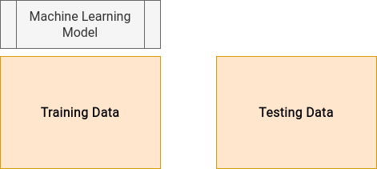

# Data Drift

¿What does data drift meaning in pydrift?

# Definition

Data drifting is all related to your features drift, it checks when the features in a dataset are not aligned with other dataset ones.

The most common use case is when you train a model with a dataset, let's call it `df_train` and you want to apply your model to other dataset, for example `df_test`.

If the data you used for training your model is different that the data when you apply the model, your model performance will be poor.

So data drift part of `pydrift` helps you to get this changes that every feature has and understanding why your model is not working well.

Your model takes into account patterns and features distributions from the training data features.

For example if you train a model with a feature that ranges between 0 and 10 and then in your test data have a different distribution, for example 100 to 1000, it won't work as expected.

# Types of data drift

- Numerical features drift: `pydrift.DataDriftChecker.check_numerical_columns`
- Categorical features drift: `pydrift.DataDriftChecker.check_categorical_columns`
- Interaction between features drift (discriminative model): `pydrift.DataDriftChecker.ml_model_can_discriminate`

# Numerical columns drift

For checking drift in numerical columns, `pydrift` takes, one by one, all of the numerical features and apply a [Kolmogorov-Smirnov Test](http://www.real-statistics.com/non-parametric-tests/goodness-of-fit-tests/two-sample-kolmogorov-smirnov-test/) for checking if the distributions are unbiased.

This is a statistical method that checks for this differences and `pydrift` uses [`stats.ks_2samp`](https://docs.scipy.org/doc/scipy/reference/generated/scipy.stats.ks_2samp.html) from the famous `scipy` python library to easily check it.

# Categorical columns drift

For checking drift in categorical columns, `pydrift` takes, one by one, all of the categorical features and apply a [chi Test](http://www.real-statistics.com/chi-square-and-f-distributions/independence-testing/) for checking if the distributions are unbiased.

This is a statistical method that checks for this differences and `pydrift` uses [`stats.chisquare`](https://docs.scipy.org/doc/scipy/reference/generated/scipy.stats.chisquare.html) from the famous `scipy` python library to easily check it.

# Interaction between features drift (discriminative model)

For a more general drift checking, `pydrift` trains a machine learning model (catboost by default, but you can use any model from `sklearn` API) creating a new target that indicates if a register comes from training distibution or from the testing one.

If the model can discriminate and obtains a good metric (AUC in this case) that means that your date is easily distinguishable, so you have a drift in your data.

If on the contrary the model is not able to differentiate between train and test data it means that you do not have any drift problem and that the data is not biased, so you will be able to apply your model without problems (waiting for the model drift checker step, that relies in your features relation with the correct target feature).
