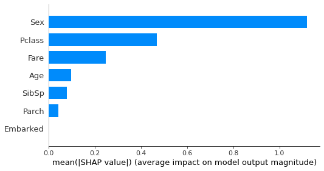
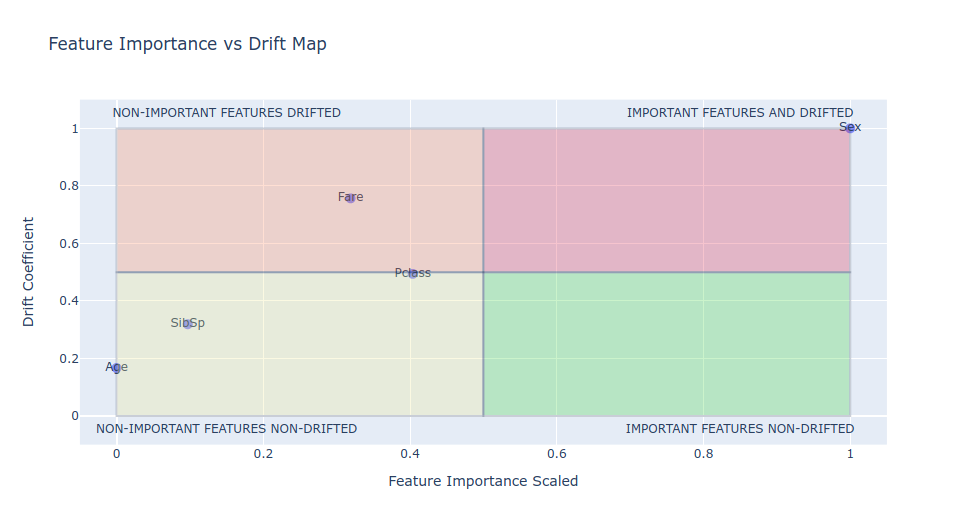
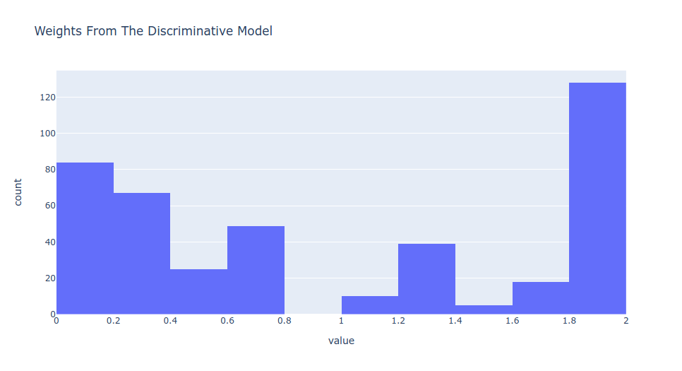
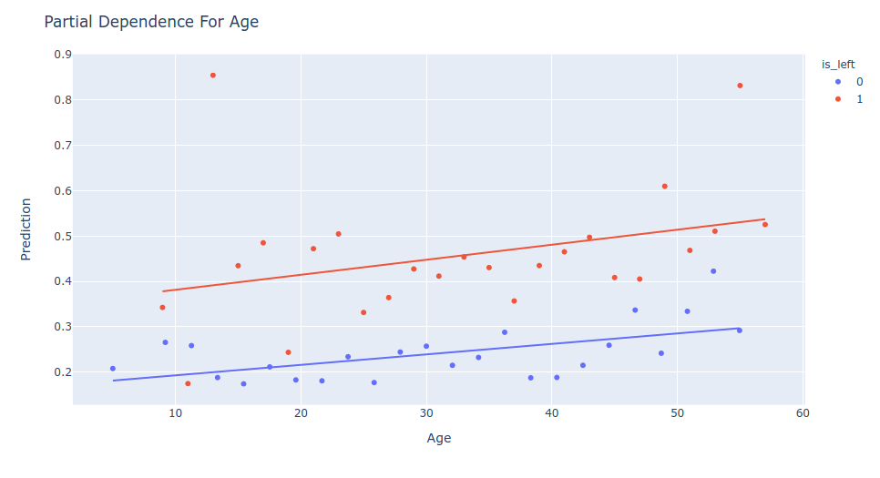
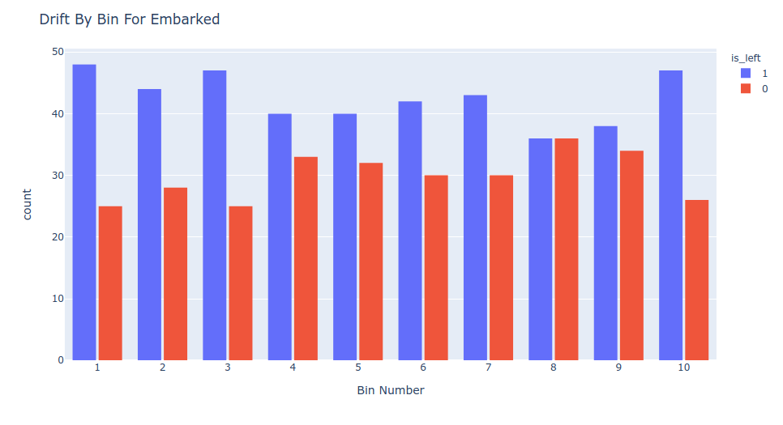

# Drift Interpretability

It's important to easily interpret our results in an end-to-end machine learning process.

> Note: For allowing `pydrift` to use this part you have to install plotly_express or latest plotly version that includes plotly_express within it

# Visualizations

- Discriminative Features: `pydrift.InterpretableDrift.most_discriminative_features_plot`
- Features Histogram Comparison: `pydrift.InterpretableDrift.both_histogram_plot`
- Feature Importance Scaled Versus Drift Coefficient: `pydrift.InterpretableDrift.feature_importance_vs_drift_map_plot`
- Weights: `pydrift.InterpretableDrift.weights_plot`
- Partial Dependence Comparison: `pydrift.InterpretableDrift.partial_dependence_comparison_plot`
- Drift By Sorted Bins: `pydrift.InterpretableDrift.drift_by_sorted_bins_plot`

# Discriminative Features

This visualization allows you to know what are the most discriminative features in terms of drift.

# Features Histogram Comparison

For checking the differences between two features distribution you can use this `pydrift` functionality.

# Feature Importance Scaled Versus Drift Coefficient

Sometimes you have some features with drift but they are not important for the model, so you can just drop them and everything will be rigth (you can keep them because they are not so important, but you will have a cleaner version of your machine learning workflow if you avoid to use them).

# Weights

Weight are the useful for retrain your model passing this weights to it. Your new model will be much more confident on the data that is not drift than on the data that it is, getting better performance.

If this visualization is too sparse it is not useful to retrain a model with this weights, but sometimes this approach is quite good.

# Partial Dependence Comparison

This visualization tells you the mean prediction of each bin of your features values. It will draw a scatter plot with a trend line if the feature you are viewing is a numerical feature and a bar plot if it is a categorical feature.

The trends in predictions given the feature value has to follow the same patterns, if not, like the example bellow there is a drift in your model predictions.

# Drift By Sorted Bins

Data contained in both datasets are concatenated and sorted by the feature you want. It divides in custom number of bins, ten by default, and count how much data is present from what dataset.

If your data has no drift all of the bins has to be almost equal.

